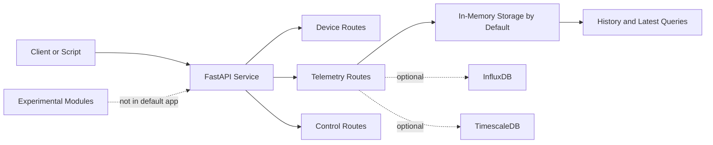

# GridOS

[](LICENSE)
[](https://www.python.org/downloads/)
[](https://github.com/iceccarelli/GridOS/actions/workflows/ci.yml)
[](https://fastapi.tiangolo.com/)

**GridOS** is a lightweight FastAPI service for **DER device registration, telemetry ingestion, telemetry lookup, and basic control workflows**.

The repository still contains broader experimental areas such as digital twin simulation, forecasting, and optimisation. Those modules remain available for contributors. The supported first-run experience is intentionally smaller so that a new user can clone the repository, start the API, send telemetry, and confirm a working result without being forced into a large deployment.

## What The Current Release Supports

| Area | Supported launch scope |
|---|---|
| API service | FastAPI app with `/`, `/health`, `/docs`, device routes, telemetry routes, and control routes |
| Telemetry | Single and batch ingestion, latest-value lookup, and bounded history queries |
| Control | Command acceptance with honest adapter status reporting |
| Default storage | In-memory mode for local development and demos |
| Optional persistence | InfluxDB and TimescaleDB when configured explicitly |
| Packaging | Editable install, reduced dependency groups, Docker image, and CI workflows |

## What Is Still Experimental

| Area | Current position |
|---|---|
| Protocol adapters | Present in the repository but not part of the launch-critical path |
| Digital twin simulation | Experimental helper modules, not required for first use |
| Forecasting | Optional module, not mounted in the default app |
| Optimisation | Optional module, not mounted in the default app |
| Large multi-service deployment | Deferred until the core local path stays stable |

## Why The Scope Is Smaller

This smaller scope is intentional. It is better for GridOS to be **simple, reliable, and truthful** than broad and internally inconsistent. The current work focuses on a dependable end-to-end path that works from a fresh clone. Experimental modules are still available for contributors, but the public launch story now matches what the repository can support immediately.

## Architecture At A Glance



## Repository Layout

| Path | Role |
|---|---|
| `src/gridos/main.py` | Active FastAPI entry point for the reduced launch path |
| `src/gridos/api/` | API routes, dependency wiring, and WebSocket manager |
| `src/gridos/models/` | Small Pydantic model surface for the supported workflow |
| `src/gridos/storage/` | Storage interface plus optional persistent backends |
| `src/gridos/digital_twin/` | Experimental simulation and ML helpers kept outside the default runtime path |
| `docs/` | Documentation aligned to the current supported scope |
| `requirements/` | Reduced dependency groups for base, dev, ml, and production |
| `tests/` | Regression tests for the lightweight supported path |

## Quick Start

### Run from source

```bash
git clone https://github.com/iceccarelli/GridOS.git
cd GridOS
python -m venv .venv
source .venv/bin/activate
pip install -e ".[dev]"
cp .env.example .env
uvicorn gridos.main:app --host 0.0.0.0 --port 8000 --reload
```

Then open:

```text
http://localhost:8000/docs
```

### Run with Docker Compose

```bash
cp .env.example .env
docker compose up --build
```

Then open:

```text
http://localhost:8000/docs
```

## Default Runtime Behavior

The default `.env.example` enables **in-memory storage**. That means the first run does not require any external database.

| Mode | Intended use |
|---|---|
| `GRIDOS_USE_INMEMORY_STORAGE=true` | Local development, demos, and validation |
| `GRIDOS_USE_INMEMORY_STORAGE=false` + InfluxDB config | Explicit persistent backend setup |
| `GRIDOS_USE_INMEMORY_STORAGE=false` + TimescaleDB config | Explicit persistent backend setup |

## Installation Targets

| Install target | Command |
|---|---|
| Core development path | `pip install -e ".[dev]"` |
| Add persistent storage drivers | `pip install -e ".[storage]"` |
| Add adapter extras | `pip install -e ".[adapters]"` |
| Add ML extras | `pip install -e ".[ml]"` |

## Testing

Protect the supported scope first.

```bash
pytest tests/test_api.py tests/test_models.py tests/test_storage.py -v --tb=short
```

## Documentation Guide

The most important docs for the current release are:

| Document | Purpose |
|---|---|
| `docs/quickstart.md` | Get a working local instance running |
| `docs/deployment.md` | Understand the supported deployment story |
| `docs/api_reference.md` | Confirm the active and optional API surface |
| `docs/models.md` | Understand the real model layer |
| `docs/adapters.md` | See the adapter framework boundaries |
| `docs/architecture.md` | See the reduced launch architecture |

## Contributing

Contributions are welcome, especially when they improve startup reliability, telemetry handling, testing, packaging, and documentation consistency. The priority is to strengthen the lightweight path before expanding the public scope again.

## License

GridOS is released under the [MIT License](LICENSE).
