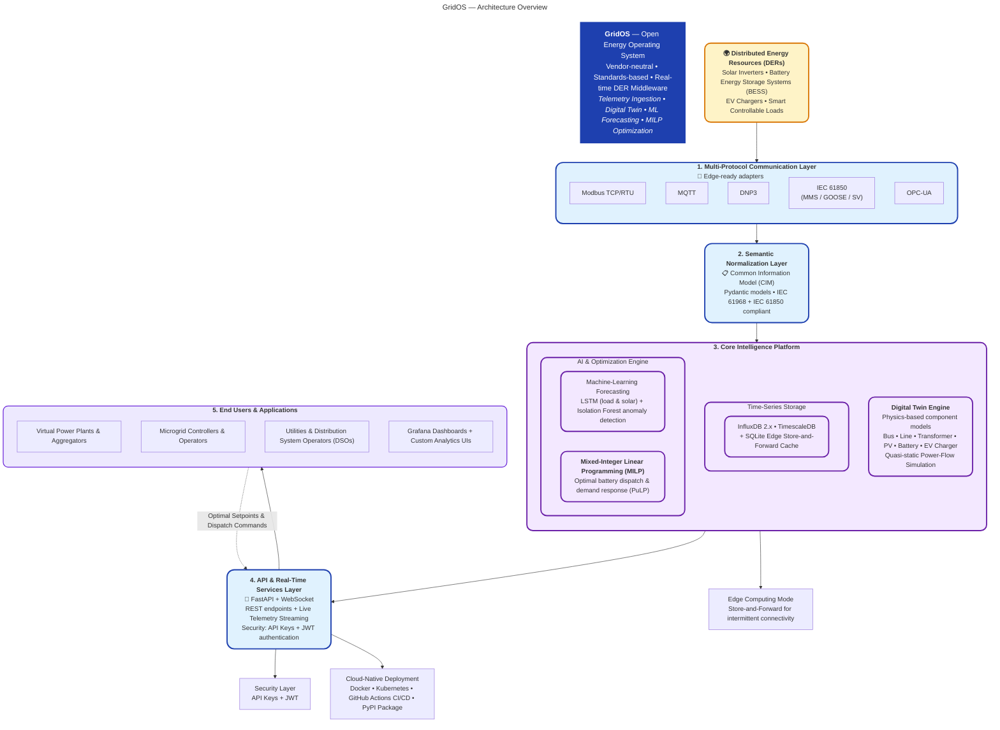
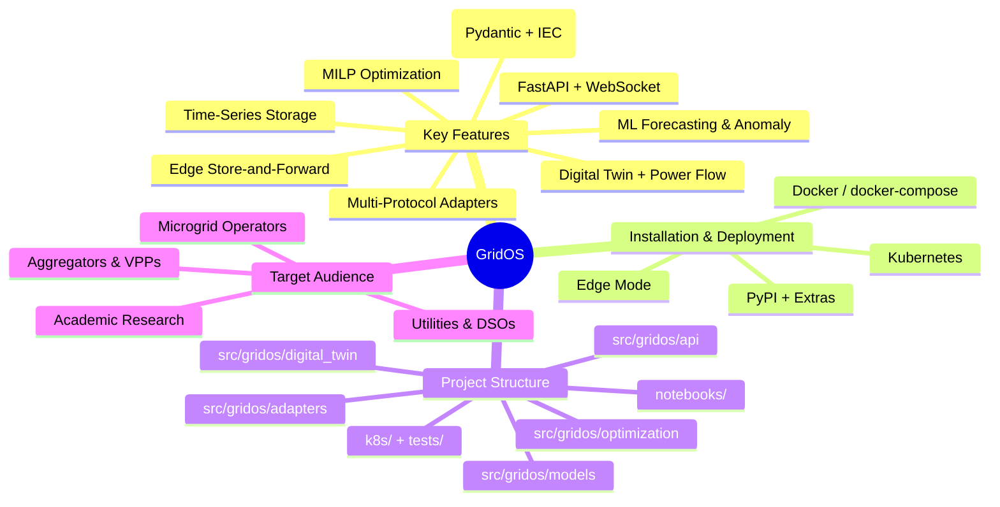

```markdown
# GridOS — Open Energy Operating System
[](LICENSE)
[](https://www.python.org/downloads/)
[](https://pypi.org/project/gridos/)
[](https://pypi.org/project/gridos/)
[](https://github.com/iceccarelli/GridOS/pkgs/container/gridos)
[](https://github.com/iceccarelli/GridOS/actions/workflows/ci.yml)
[](https://fastapi.tiangolo.com/)
[](https://github.com/astral-sh/ruff)

**GridOS** aims to be a vendor-neutral, open-source middleware platform that unifies **Distributed Energy Resources (DERs)** — solar inverters, batteries, EV chargers, smart loads — behind a single, standards-based API. It provides real-time telemetry ingestion, digital-twin simulation, ML-driven forecasting, and optimal energy dispatch, enabling utilities, aggregators, and microgrid operators to accelerate the energy transition.

---

## Key Features
| Capability                  | Description |
|-----------------------------|-------------|
| **Multi-Protocol Adapters** | Modbus TCP/RTU, MQTT, DNP3, IEC 61850, OPC-UA — connect any DER out of the box. |
| **Common Information Model**| Pydantic models aligned with IEC 61968/61850 for interoperable data exchange. |
| **Time-Series Storage**     | Pluggable backends for InfluxDB 2.x and TimescaleDB with async I/O. |
| **Digital Twin Engine**     | Physics-based component models (bus, line, transformer, PV, battery, EV charger) with simplified power-flow simulation. |
| **ML Forecasting**          | LSTM-based load and solar forecasting plus Isolation Forest anomaly detection. |
| **MILP Optimization**       | Mixed-Integer Linear Programming scheduler for optimal battery dispatch and demand response. |
| **REST + WebSocket API**    | FastAPI-powered endpoints with live telemetry streaming via WebSockets. |
| **Edge Support**            | SQLite-based store-and-forward cache for intermittent connectivity. |
| **Cloud-Native Deployment** | Docker Compose, Kubernetes manifests, and GitHub Actions CI/CD included. |

---

## Architecture Overview



---

## System Data Flow & Closed-Loop Control

```mermaid
flowchart LR
    A[Telemetry Ingestion<br/>Multi-Protocol Adapters] --> B[CIM Normalization<br/>Pydantic Models]
    B --> C[Digital Twin State Update<br/>Physics-based Power Flow]
    C --> D[Forecasting & Analytics<br/>LSTM + Isolation Forest]
    D --> E[Optimization Solver<br/>MILP (PuLP)]
    E --> F[Optimal Dispatch Commands<br/>Battery / DER Control]
    F -.-> A
    style E fill:#4f46e5,color:#fff,stroke:#c4b5fd,stroke-width:3px
```

---

## Project Overview Mindmap



---

## Installation
### Option 1: Install from PyPI (Recommended)
```bash
pip install gridos
```
With optional dependencies:
```bash
# Machine learning (LSTM forecasting, anomaly detection)
pip install gridos[ml]
# Protocol adapters (Modbus, MQTT, OPC-UA)
pip install gridos[adapters]
# Storage backends (InfluxDB, TimescaleDB)
pip install gridos[storage]
# Everything
pip install gridos[ml,adapters,storage]
```

### Option 2: Run with Docker
```bash
docker pull ghcr.io/iceccarelli/gridos:latest
docker run -p 8000:8000 ghcr.io/iceccarelli/gridos:latest
```
The API is now available at `http://localhost:8000/docs`.

### Option 3: Run with Docker Compose (Full Stack)
```bash
git clone https://github.com/iceccarelli/GridOS.git
cd GridOS
docker-compose up -d
```
This starts GridOS alongside InfluxDB, TimescaleDB, and Grafana.

### Option 4: Install from Source
```bash
git clone https://github.com/iceccarelli/GridOS.git
cd GridOS
python -m venv .venv
source .venv/bin/activate
# Install with dev dependencies
pip install -e ".[dev]"
```

---

## Quick Start
### Configuration
```bash
# Copy the example environment file
cp .env.example .env
# Edit .env with your settings (storage URLs, broker addresses, etc.)
```

### Run the API Server
```bash
uvicorn gridos.main:app --host 0.0.0.0 --port 8000 --reload
```
The interactive API documentation is available at `http://localhost:8000/docs`.

---

## Project Structure
```
GridOS/
├── src/gridos/          # Core Python package
│   ├── models/          # Pydantic CIM models
│   ├── adapters/        # Protocol adapters (Modbus, MQTT, DNP3, …)
│   ├── storage/         # Time-series backends (InfluxDB, TimescaleDB)
│   ├── digital_twin/    # Simulation engine + ML modules
│   ├── optimization/    # MILP scheduler and dispatch
│   ├── api/             # FastAPI routes and WebSocket manager
│   ├── edge/            # Edge caching (SQLite store-and-forward)
│   ├── security/        # API key + JWT authentication
│   └── utils/           # Logging, metrics, and shared utilities
├── tests/               # Pytest test suite (70 tests)
├── notebooks/           # Jupyter demo notebooks
├── data/                # Sample datasets
├── docs/                # Architecture, API reference, developer guide
├── k8s/                 # Kubernetes manifests
├── scripts/             # Utility and demo scripts
└── requirements/        # Dependency files (base, ml, dev, prod)
```

---

## Running Tests
```bash
pytest tests/ -v --cov=gridos --cov-report=term-missing
```

---

## Notebooks
Explore the interactive Jupyter notebooks in `notebooks/`:
1. **Data Ingestion Demo** — Connect adapters and ingest telemetry.
2. **Digital Twin Simulation** — Build a grid model and run power-flow.
3. **Forecasting with ML** — Train an LSTM on solar generation data.
4. **Optimization Scheduler** — Solve optimal battery dispatch with MILP.
5. **API Client** — Interact with the REST API programmatically.

---

## Contributing
We welcome contributions from the Grid Digitization community. Please read [CONTRIBUTING.md](CONTRIBUTING.md) for guidelines on how to get started.

---

## Security
If you discover a security vulnerability, please follow the responsible disclosure process described in [SECURITY.md](SECURITY.md).

---

## License
GridOS is released under the [MIT License](LICENSE).

---

## Acknowledgements
GridOS builds on the shoulders of outstanding open-source projects including FastAPI, Pydantic, PuLP, scikit-learn, InfluxDB, TimescaleDB, and many others. We are grateful to the energy systems research community for the standards and models that inform this work.
```
