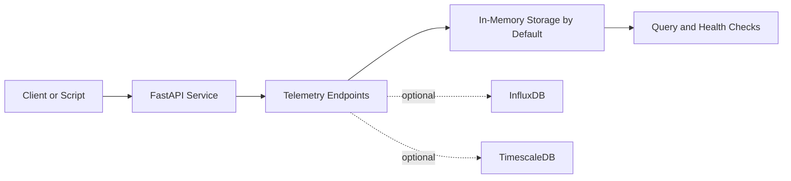

# GridOS

[](LICENSE)
[](https://www.python.org/downloads/)
[](https://github.com/iceccarelli/GridOS/actions/workflows/ci.yml)
[](https://fastapi.tiangolo.com/)

**GridOS** is a small FastAPI-based platform for **DER telemetry ingestion and grid-oriented experimentation**. The current goal is not to present a complete operating system for energy networks. The goal is to provide a repository that people can clone, run, understand, and extend without being forced into a large deployment or a long list of partially implemented integrations.

At this stage, the description of GridOS is a **working prototype with a deliberately reduced launch scope**. The supported first-run path is a local API, interactive documentation, telemetry ingestion, telemetry querying, health checks, and a simple storage mode that can run entirely in memory for development. Optional persistent backends remain in the codebase, but they are no longer the default promise.

## What This Version Intentionally Supports

The project is being narrowed so that the public surface matches what new users can actually run successfully.

| Area | Supported launch scope |
|---|---|
| **API service** | FastAPI application with `/`, `/health`, and `/docs` |
| **Telemetry** | Ingest single and batch telemetry payloads and query telemetry history |
| **Default storage mode** | In-memory storage for local development and demos |
| **Optional persistence** | InfluxDB and TimescaleDB can still be configured explicitly |
| **Developer experience** | Simple source install and a lightweight Docker path |

## What This Version Does **Not** Promise Yet

GridOS is **not** currently presented as a complete production-grade DER middleware platform. The repository still contains broader ideas and experimental modules.

| Capability | Current position |
|---|---|
| Broad protocol adapter support | Present in the repository, but not part of the launch-critical promise |
| Advanced digital twin workflows | Experimental and not required for first use |
| Advanced forecasting and optimization | Experimental and not required for first use |
| Full external observability stack | Deferred |
| Large multi-service deployment story | Deferred |

## Why The Scope Is Smaller

This smaller scope is intentional. It is better for GridOS to be **simple and reliable** than broad and inconsistent. The immediate objective is an end-to-end path that works when someone clones the repository for the first time. Once that path is stable, the project can expand again from a stronger base.

## Architecture

The current launch path is centered on a small execution flow.



This means the default experience does not depend on external infrastructure. Persistent storage remains available for later stages, but it is optional rather than mandatory for the first successful run.

## Repository Layout

| Path | Role |
|---|---|
| `src/gridos/main.py` | FastAPI entry point |
| `src/gridos/api/` | API routes and dependency wiring |
| `src/gridos/storage/` | Storage interfaces and optional persistent backends |
| `docs/` | Reduced-scope product and setup documentation |
| `requirements/` | Lean dependency groups |
| `tests/` | Regression checks for the supported path |

## Quick Start

### Run from source

```bash
git clone https://github.com/iceccarelli/GridOS.git
cd GridOS
python -m venv .venv
source .venv/bin/activate
pip install -e ".[dev]"
cp .env.example .env
uvicorn gridos.main:app --host 0.0.0.0 --port 8000 --reload
```

Then open:

```text
http://localhost:8000/docs
```

### Run with Docker Compose

```bash
cp .env.example .env
docker compose up --build
```

Then open:

```text
http://localhost:8000/docs
```

## Default Runtime Behavior

The default `.env.example` enables **in-memory storage**. That makes the first run easier because no database is required just to validate the API and telemetry workflow.

If you later want persistence, you can disable in-memory mode and point GridOS to one of the optional storage backends.

| Mode | Intended use |
|---|---|
| `GRIDOS_USE_INMEMORY_STORAGE=true` | Local development, demos, and first-run validation |
| `GRIDOS_USE_INMEMORY_STORAGE=false` + InfluxDB config | Explicit persistent backend setup |
| `GRIDOS_USE_INMEMORY_STORAGE=false` + TimescaleDB config | Explicit persistent backend setup |

## Example Telemetry Payload

```json
{
  "device_id": "demo-device-1",
  "timestamp": "2026-01-01T12:00:00Z",
  "power_kw": 12.5,
  "reactive_power_kvar": 1.8,
  "status": "online"
}
```

The exact accepted schema should always be confirmed through the running OpenAPI documentation at `/docs`.

## Installation Philosophy

GridOS now favors a **small default installation**. Heavy ML packages, adapter packages, and persistent storage drivers are no longer treated as part of the default requirement set.

| Install target | Command |
|---|---|
| Core development path | `pip install -e ".[dev]"` |
| Add persistent storage drivers | `pip install -e ".[storage]"` |
| Add adapters | `pip install -e ".[adapters]"` |
| Add ML extras | `pip install -e ".[ml]"` |

## Testing

The most valuable tests for this phase are the ones that protect the smaller supported scope.

```bash
pytest tests/ -v
```

In practice, this means protecting API startup, health checks, telemetry ingestion, telemetry queries, and the default storage path.

## Documentation

The documentation under `docs/` has been reduced to match the smaller supported scope. It should be read as a practical guide to the current working product, not as a promise that every experimental module in the repository is launch-ready.

## Contributing

Contributions are welcome, especially when they improve clarity, testing, startup reliability, telemetry handling, and documentation consistency. The priority is to strengthen the default path before expanding the scope again.

## Security

If you discover a security issue, please follow the process described in `SECURITY.md`. Security improvements are especially valuable when they simplify configuration and reduce unsafe defaults.

## License

GridOS is released under the [MIT License](LICENSE).
