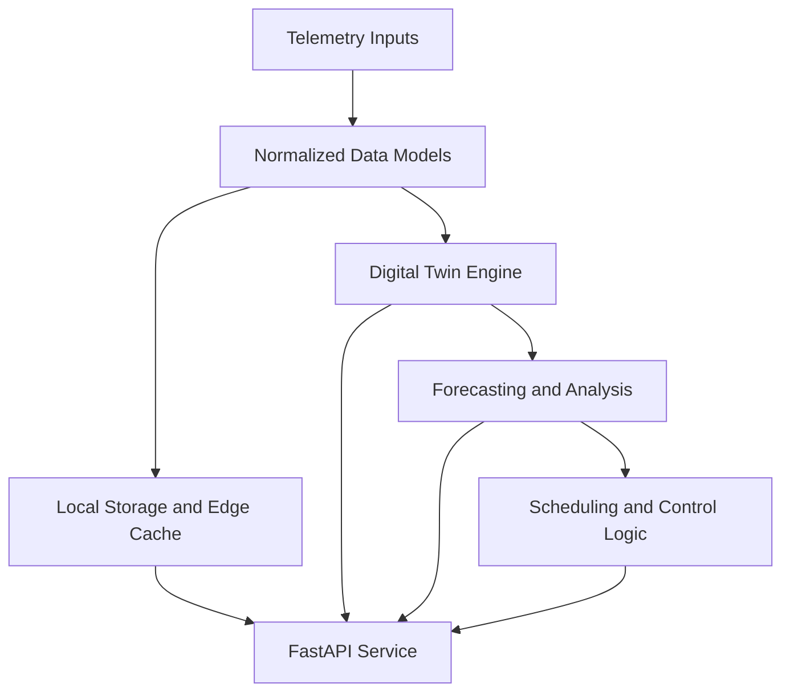

# GridOS

[](LICENSE)
[](https://www.python.org/downloads/)
[](https://github.com/iceccarelli/GridOS/actions/workflows/ci.yml)
[](https://fastapi.tiangolo.com/)
[](https://github.com/astral-sh/ruff)

**GridOS** is a lightweight platform for **DER telemetry, local-first smart-grid prototyping, and digital-twin experimentation**. It is designed for developers, researchers, and operators who want a practical foundation for working with distributed energy resource data and simplified grid models.

At this stage, GridOS should be understood as a **working prototype platform**, not as a complete grid operating system. The current focus is on providing a small, understandable core that can run locally, expose a FastAPI service, ingest telemetry, support a local cache/storage path, and demonstrate digital-twin and scheduling workflows without requiring a large deployment footprint.

## What GridOS Currently Focuses On

The most important goal for GridOS right now is to make the default path **simple, truthful, and reproducible**. That means a smaller feature set, clearer documentation, and fewer assumptions about external infrastructure.

| Area | Current Focus |
|---|---|
| **Telemetry** | Ingesting DER-style telemetry through a FastAPI service |
| **Digital Twin** | Running simplified grid and asset simulations locally |
| **Edge / Local Operation** | Supporting local cache and store-and-forward style workflows |
| **Forecasting** | Providing simple forecasting paths, with advanced ML treated as optional |
| **Scheduling** | Providing baseline scheduling logic, with advanced optimization treated as optional |
| **Developer Experience** | Keeping local setup and experimentation straightforward |

## What GridOS Is Not Claiming Yet

GridOS is intentionally **not** claiming to be a complete, production-ready orchestration system for every DER protocol and deployment scenario. Some modules already exist in the repository for advanced protocol integrations, external storage backends, ML workflows, and additional runtime modes, but they should currently be understood as **in progress**, **optional**, or **experimental** unless they are explicitly documented as part of the supported default workflow.

## Current Supported Scope

The table below describes the most honest way to think about the project today.

| Capability | Current Status |
|---|---|
| FastAPI application | **Supported** |
| Local API docs | **Supported** |
| Telemetry ingestion path | **Supported as a core direction** |
| Digital twin simulation | **Supported** |
| Local cache / edge-style storage | **Supported** |
| Baseline forecasting workflow | **Supported** |
| Baseline scheduling workflow | **Supported** |
| External time-series backends | **Optional / evolving** |
| Protocol adapter breadth | **Experimental / evolving** |
| WebSocket streaming | **Not part of the core promise yet** |
| Advanced ML forecasting | **Optional / evolving** |
| Advanced MILP optimization | **Optional / evolving** |

## Why This Scope Is Smaller

This narrower scope is intentional. The project is easier to trust when the README describes what the repository can actually support today. The goal is to build a stable foundation first and then expand carefully, instead of presenting every planned feature as if it were already fully mature.

## Architecture Overview

GridOS is organized around a small number of core layers that are useful even in local or research-oriented deployments.



The intent of this architecture is straightforward. Telemetry enters the system, is normalized into internal models, can be persisted locally, and can then be used by simulation, forecasting, and scheduling layers that are exposed through a developer-friendly API.

## Core Components

| Component | Purpose |
|---|---|
| `src/gridos/api` | FastAPI routes, dependencies, and API-facing behavior |
| `src/gridos/digital_twin` | Simplified simulation models for grid and asset behavior |
| `src/gridos/edge` | Local cache and offline-friendly data handling |
| `src/gridos/models` | Shared application data models |
| `src/gridos/optimization` | Baseline scheduling and dispatch-related logic |
| `src/gridos/storage` | Storage abstractions and optional backend integrations |
| `src/gridos/security` | Authentication-related helpers and API protection building blocks |
| `src/gridos/adapters` | Communication-layer modules that are still evolving |

## Installation

The recommended path is to install GridOS from source in a virtual environment so that the local setup stays explicit and easy to debug.

### Install from Source

```bash
git clone https://github.com/iceccarelli/GridOS.git
cd GridOS
python -m venv .venv
source .venv/bin/activate
pip install -e ".[dev]"
```

If you prefer a leaner setup, you can install only the base package and add optional extras later as needed. The project should be treated as **local-first by default**, with optional integrations added only when you are ready to use them.

## Quick Start

The intended quick start for GridOS is a simple local workflow.

### 1. Prepare the Environment

```bash
cp .env.example .env
```

Start with the default local configuration and only add external service settings if you actually need them.

### 2. Run the API

```bash
uvicorn gridos.main:app --host 0.0.0.0 --port 8000 --reload
```

Once the server is running, open the interactive documentation at:

```text
http://localhost:8000/docs
```

### 3. Explore the Core Workflow

The intended first experience is to do one or more of the following:

| First Step | Why it matters |
|---|---|
| Open `/docs` | Verifies that the API starts correctly |
| Send a telemetry payload | Verifies the API-facing data path |
| Run a notebook or demo script | Verifies the local simulation workflow |
| Inspect the local cache behavior | Verifies the edge/local-first design direction |

## Example Telemetry Payload

A minimal example payload for experimentation can follow the project’s telemetry model structure.

```json
{
  "device_id": "demo-device-1",
  "timestamp": "2026-01-01T12:00:00Z",
  "power_kw": 12.5,
  "reactive_power_kvar": 1.8,
  "status": "online"
}
```

The exact fields should always follow the current API schema exposed in the running documentation.

## Project Structure

```text
GridOS/
├── src/gridos/
│   ├── adapters/
│   ├── api/
│   ├── digital_twin/
│   ├── edge/
│   ├── models/
│   ├── optimization/
│   ├── security/
│   ├── storage/
│   └── utils/
├── tests/
├── notebooks/
├── docs/
├── scripts/
└── requirements/
```

The repository is intentionally organized so that the core product path remains understandable: API, simulation, storage, scheduling, and local experimentation are the center of gravity.

## Testing

GridOS includes a pytest-based test suite. The most useful immediate check is to run the automated tests locally before changing behavior.

```bash
pytest tests/ -v --cov=gridos --cov-report=term-missing
```

For current development, the most valuable tests are the ones that protect the basic end-to-end path: startup, telemetry handling, simulation behavior, cache behavior, and core scheduling flows.

## Notebooks and Demos

The notebooks and demo material are intended to help users understand the project’s working core. The most useful use cases at the moment are local experimentation, digital-twin exploration, and prototype workflows for DER telemetry and simulation.

| Demo Area | Current Role |
|---|---|
| Telemetry examples | Show how data enters the system |
| Digital twin examples | Show local simulation behavior |
| Forecasting examples | Show baseline analytical workflows |
| Scheduling examples | Show simplified decision logic |

Where advanced dependencies are required, those paths should be treated as optional rather than part of the default promise.

## Deployment Philosophy

GridOS is being shaped around a **local-first, understandable, modular** deployment style. External databases, additional protocol layers, and more advanced orchestration features may be useful later, but they should not be required for the basic experience of cloning the repository and getting value from it.

That means the near-term priority is not maximum complexity. It is a smaller platform that is easier to run, easier to test, and easier to extend honestly.

## Roadmap Direction

The long-term direction of GridOS is still broader than the current supported scope, but the project is deliberately being narrowed so that the public description stays aligned with what works.

| Near-Term Direction | Intent |
|---|---|
| Improve the local default runtime | Make the first-run experience reliable |
| Strengthen telemetry and API behavior | Make the core service path dependable |
| Keep digital-twin workflows clear and usable | Preserve the strongest current part of the project |
| Treat advanced integrations as optional | Avoid over-promising |
| Expand only after the default path is stable | Grow from a solid base |

## Contributing

Contributions are welcome, especially when they improve clarity, stability, testing, documentation, and the default developer experience. If you would like to contribute, please start with the current supported scope and help make the main workflow more reliable before expanding the project surface.

Please read [CONTRIBUTING.md](CONTRIBUTING.md) for contribution guidelines.

## Security

If you discover a security issue, please follow the process described in [SECURITY.md](SECURITY.md). Security-related contributions are especially valuable when they improve authentication behavior, configuration safety, dependency hygiene, and the default local deployment path.

## License

GridOS is released under the [MIT License](LICENSE).

## Acknowledgements

GridOS builds on a wide range of open-source work in APIs, data modeling, simulation, and developer tooling. The project is also informed by ongoing work in smart grids, DER integration, and software for energy systems. The goal is to contribute back by building a practical foundation that others can inspect, test, and improve.
