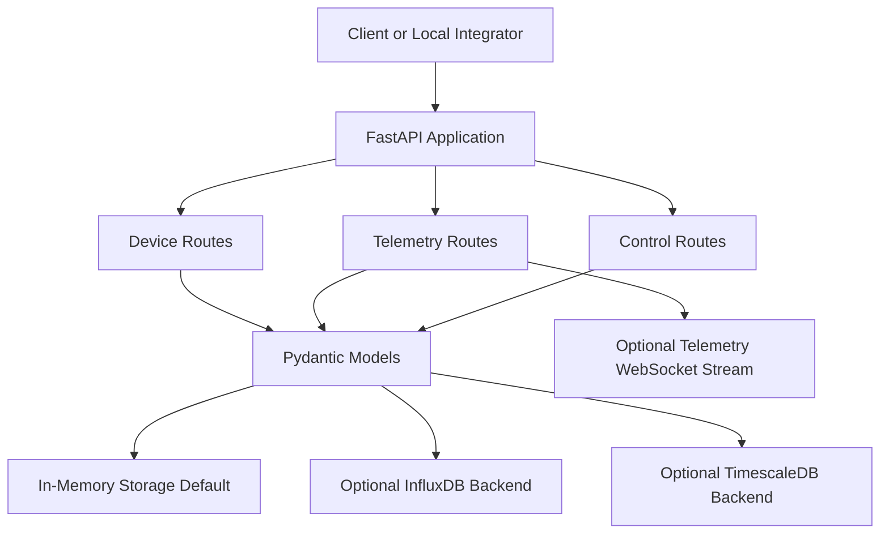

# GridOS Architecture

GridOS is currently best understood as a **small FastAPI service for DER device registration, telemetry handling, and basic control workflows**.

This document describes the **actual reduced architecture that the repository is intended to support today**. It does not describe the larger future vision as if it were already delivered.

## Architectural Intent

The current architecture is designed around a narrow, reliable launch path:

1. A FastAPI application exposes the public API.
2. Pydantic models validate device, telemetry, and control payloads.
3. A local in-memory storage backend supports first-run operation with no external services.
4. Optional storage backends can be enabled later for persistence.
5. The API returns honest responses about what it accepted, stored, or could not dispatch.

## Reduced Architecture Overview

## Core Layers

| Layer | Role in the current launch path |
|---|---|
| API layer | Exposes the supported HTTP and WebSocket surface |
| Model layer | Validates and normalizes request and response data |
| Storage layer | Provides the default in-memory data path and optional persistent backends |
| Device registry | Keeps local device metadata for supported workflows |
| Control handling | Accepts commands and reports whether dispatch actually occurred |

## Current Supported Surface

| Area | Status |
|---|---|
| Device registration and lookup | Supported |
| Telemetry ingestion and history queries | Supported |
| Latest telemetry lookup | Supported |
| Basic control command acceptance | Supported |
| WebSocket telemetry stream | Optional |
| Forecasting routes | Excluded from the default launch path |
| Optimization routes | Excluded from the default launch path |
| Digital twin engine | Deferred |
| Broad protocol adapter automation | Deferred |

## Data Flow

A typical supported flow is straightforward.

First, a client registers a device. Next, the client sends telemetry for that device. The application validates the payload and stores it in the in-memory backend by default. The same data can then be retrieved through history or latest-value queries. Control commands can also be submitted, and the API responds honestly if no live adapter is attached.

## Architectural Boundaries

This repository should not currently be presented as a full operating system for every DER environment. It is a **working local-first telemetry and control foundation**. That smaller claim is the correct one for the present release.
