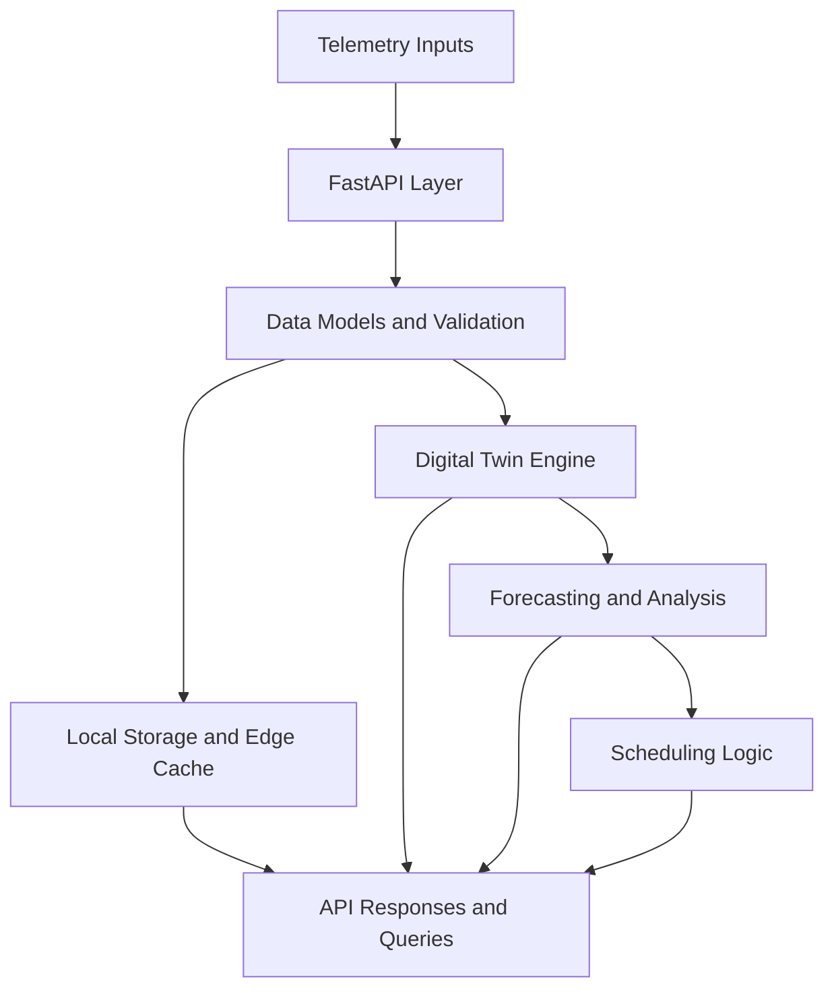

# GridOS Architecture

GridOS is currently best understood as a **lightweight platform for DER telemetry, local-first storage, digital-twin experimentation, and simplified scheduling workflows**.

This document describes the **current reduced architecture**, not the full long-term vision. The goal is to explain the working core clearly and honestly.

## Architectural Intent

The present version of GridOS is designed around a small number of cooperating layers:

1. A FastAPI service that exposes the application.
2. A telemetry path that accepts structured DER-style data.
3. A local-friendly persistence and cache path.
4. A digital-twin layer for simulation and experimentation.
5. A small analytical layer for forecasting and scheduling workflows.

## Reduced Architecture Overview

This is the system users should evaluate today. It is intentionally smaller than the broader vision because the current launch priority is a platform that works end-to-end rather than one that advertises every future feature.

## Core Layers

| Layer | Role |
|---|---|
| API Layer | Exposes the service and user-facing routes |
| Model Layer | Validates and normalizes application data |
| Storage Layer | Supports local persistence and cache-oriented workflows |
| Digital Twin Layer | Supports simulation and experimentation |
| Analysis Layer | Supports baseline forecasting and scheduling workflows |

## Current Design Priorities

| Priority | Meaning |
|---|---|
| Local-first operation | The simplest useful runtime should work without unnecessary infrastructure |
| Clear API behavior | The exposed endpoints should reflect the real supported product |
| Small supported scope | The launch version should be easy to understand and trust |
| Extensibility | Advanced features can return later from a stable base |

## Components in the Repository

| Component Area | Current Position |
|---|---|
| FastAPI service | Core to the launch path |
| Local storage and edge cache | Core to the launch path |
| Digital twin engine | Core to the launch path |
| Forecasting | Kept in a smaller, practical form |
| Scheduling / optimization | Kept in a smaller, practical form |
| Broad adapter ecosystem | Not part of the core launch promise |
| External storage backends | Optional, not central |
| WebSocket-heavy workflows | Not part of the core launch promise |

## Data Flow

A typical request flow in the current architecture is:

1. A client submits telemetry or a query through the API.
2. The data is validated against the core models.
3. The platform stores or forwards the data through the local-first path.
4. The digital-twin and analysis layers can consume that data for simulation or decision-support workflows.
5. The API returns results through the supported interface.

## Architectural Boundaries

This document deliberately does not present GridOS as a full autonomous operating system for all DER environments. It is a strong foundation for smart-grid prototyping and local-first experimentation, and that is the right level of promise for the current release.
